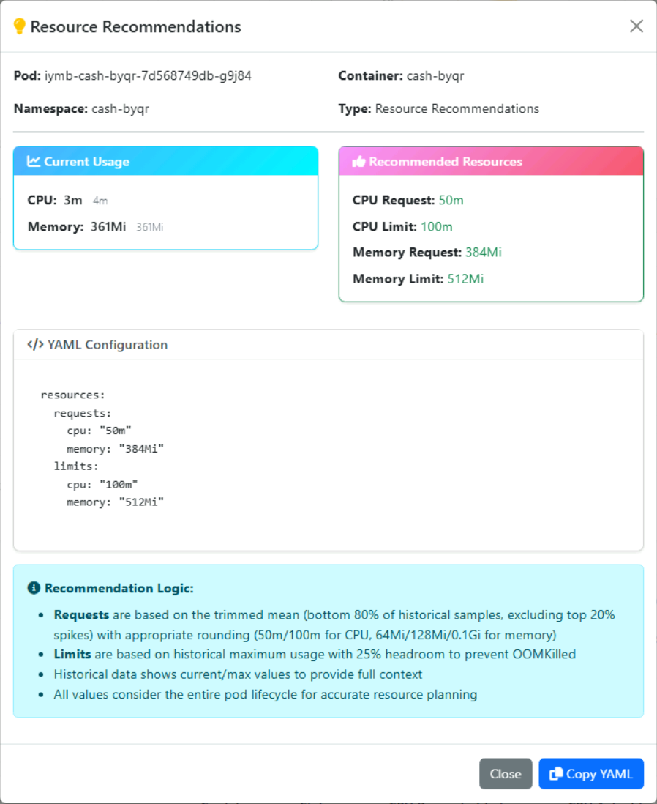
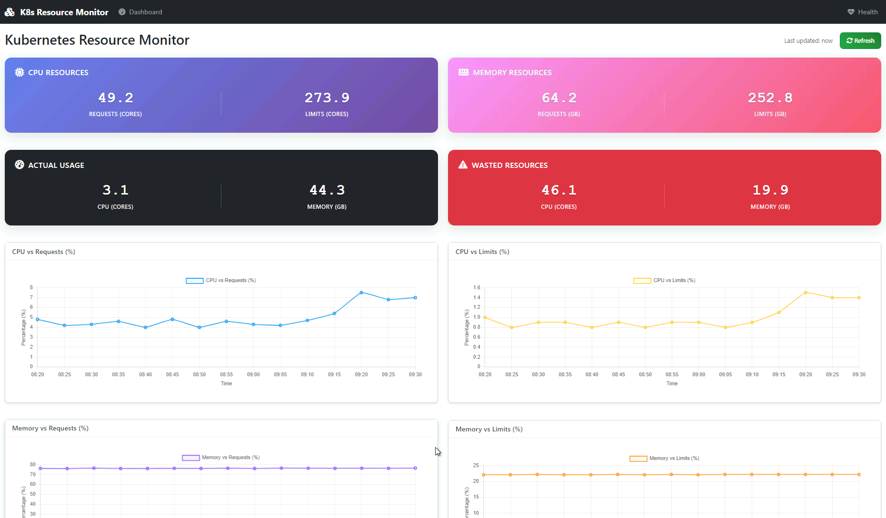
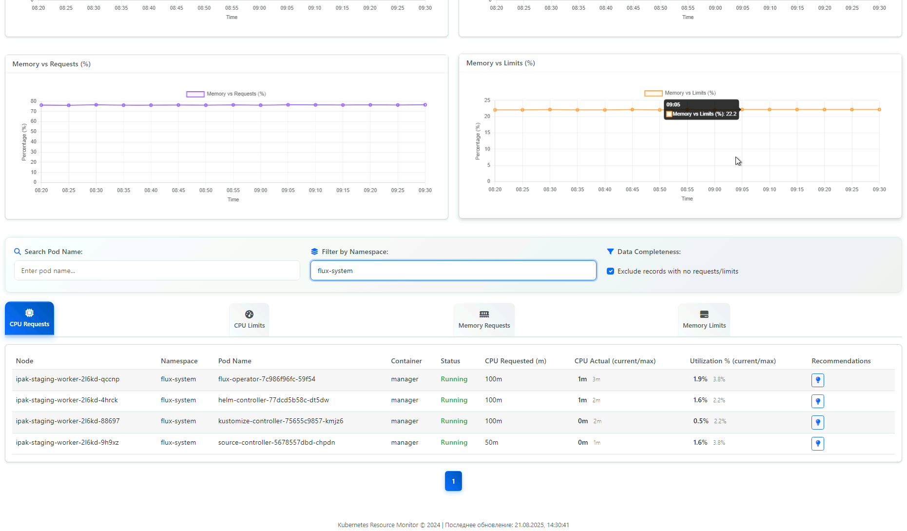

# Kubernetes Resource Monitor

**A comprehensive monitoring and analysis tool for Kubernetes resource utilization.** Compare your declared resources (requests/limits) with actual CPU and memory consumption to optimize your cluster efficiency.


> 🎯 **Perfect for** DevOps engineers, Platform teams, and anyone looking to optimize Kubernetes resource allocation and reduce costs.

## 📸 See It In Action

<table>
<tr>
<td width="50%" align="center">

<br><em>Smart resource recommendations with auto-generated YAML</em>
</td>
<td width="50%">

<br><em>Main dashboard with cluster metrics and insights</em>
<br><br>

<br><em>Interactive tables with resource data and consumption history</em>
</td>
</tr>
</table>

## 🚀 Quick Start

### Prerequisites
- Docker and Docker Compose
- Kubernetes cluster access (kubeconfig)
- Prometheus server access

### Installation & Launch

```bash
# 1. Clone the repository
git clone https://github.com/AllYouZombies/fastapi-k8s-resource-dashboard.git
cd fastapi-k8s-resource-dashboard

# 2. Configure environment
cp .env.example .env
# Edit .env and set your Prometheus URL:
# PROMETHEUS_URL=http://your-prometheus:9090

# 3. Start the application (automated script)
./start.sh
```

**Alternative manual start:**

```bash
# Create necessary directories
mkdir -p data logs

# Start with Docker Compose
docker-compose up -d

# Check logs
docker-compose logs -f
```

### Access the Application

- 🌐 **Main Interface**: http://localhost:8000
- 📊 **Dashboard**: http://localhost:8000/dashboard  
- ❤️ **Health Check**: http://localhost:8000/health

## ✨ Key Features

- 📊 **Resource Monitoring** - Track CPU and memory usage across all pods with historical data (current/max)
- 📈 **Interactive Tables** - 4 specialized tables with search, filtering, and sorting capabilities
- 📊 **Real-time Charts** - Monitor utilization percentages for CPU/Memory vs requests/limits
- 🔧 **Smart Recommendations** - Auto-calculate optimal requests/limits with ready-to-use YAML
- ⏱️ **Automated Collection** - Data updates every 5 minutes from Kubernetes API and Prometheus
- 🔍 **Advanced Filtering** - Filter by namespace, incomplete data, exclude system namespaces

### How It Works

**The dashboard provides:**
- Summary panel with cluster-wide metrics
- 4 interactive utilization charts (CPU/Memory vs Requests/Limits)
- 4 resource tables with search, filtering, and sorting
- Smart recommendation buttons in each table row

**Recommendation system:**
- Requests based on current consumption patterns
- Limits calculated from historical maximum usage + 25% headroom
- Auto-generated ready-to-use YAML configurations

## 🛠️ Technical Stack

**Technology stack:**
- FastAPI (async Python web framework)
- Bootstrap 5 + Chart.js + DataTables
- SQLite with optimized time-series indexes
- Kubernetes API + Prometheus API integration

**Security features:**
- Minimal RBAC permissions (read-only access)
- Non-privileged container user
- System namespace exclusion (kube-system, etc.)

## ⚙️ Configuration

**Required settings in `.env` file:**

```bash
# Your Prometheus server URL (REQUIRED!)
PROMETHEUS_URL=http://your-prometheus:9090

# Path to kubeconfig (defaults to ~/.kube/config)
KUBECONFIG_PATH=~/.kube/config

# Host user UID/GID (automatically set by start.sh)
HOST_UID=1000
HOST_GID=1000
```

**Environment examples:**

```bash
# Local Prometheus
PROMETHEUS_URL=http://localhost:9090

# Prometheus in Kubernetes
PROMETHEUS_URL=http://kube-prometheus-stack-prometheus.monitoring.svc:9090

# External Prometheus
PROMETHEUS_URL=https://prometheus.company.com

# Port-forwarded Prometheus
PROMETHEUS_URL=http://host.docker.internal:9090
```

### Kubeconfig Access

The container creates a user with the same UID/GID as the host user for kubeconfig file access. This is automatically configured through Docker Compose build args:

```yaml
build:
  args:
    HOST_UID: ${HOST_UID:-1000}
    HOST_GID: ${HOST_GID:-1000}
```

The `start.sh` script automatically detects your UID/GID and adds them to the `.env` file.

## 🔧 Management

### Make Commands

```bash
make help       # Show all available commands
make start      # Start application
make stop       # Stop application
make logs       # View logs
make restart    # Restart application
make clean      # Clean data
```

### Docker Compose Commands

```bash
docker-compose up -d        # Start in background
docker-compose logs -f      # Follow logs
docker-compose ps           # Container status
docker-compose down         # Stop and remove
```

## 📡 REST API

**Main endpoints:**
- `GET /api/metrics` - Metrics with pagination and filters
- `GET /api/chart-data` - Chart data for visualizations
- `GET /api/recommendations/{pod_name}/{container_name}` - Resource recommendations
- `GET /health` - System health status

## 🚀 Kubernetes Deployment

Deploy to Kubernetes using the provided manifests:

```bash
kubectl apply -f k8s/
```

The `k8s/` directory contains all necessary resources (Deployment, Service, RBAC).

## 🤝 Contributing

We welcome contributions from the community! Here's how you can help:

- 🐛 **Report bugs** - [Open an issue](https://github.com/AllYouZombies/fastapi-k8s-resource-dashboard/issues)
- 💡 **Suggest features** - Share your ideas for improvements
- 🔧 **Submit pull requests** - Help improve the code
- 📖 **Improve documentation** - Make it easier for others to contribute

### Quick Contribution Guide

1. Fork the repository
2. Create a feature branch: `git checkout -b feature/amazing-feature`
3. Make your changes and test them
4. Commit: `git commit -m 'Add amazing feature'`
5. Push: `git push origin feature/amazing-feature`
6. Open a Pull Request

See our [CONTRIBUTING.md](CONTRIBUTING.md) for detailed guidelines.

## 📞 Support & Community

- 🐛 **Issues**: [GitHub Issues](https://github.com/AllYouZombies/fastapi-k8s-resource-dashboard/issues)
- 💬 **Discussions**: [GitHub Discussions](https://github.com/AllYouZombies/fastapi-k8s-resource-dashboard/discussions)
- 📋 **Project Board**: [GitHub Projects](https://github.com/AllYouZombies/fastapi-k8s-resource-dashboard/projects)

## 📝 License

This project is licensed under the MIT License - see the [LICENSE](LICENSE) file for details.

---

**Made with ❤️ for the Kubernetes community**

[](https://github.com/AllYouZombies/fastapi-k8s-resource-dashboard/stargazers)
[](https://github.com/AllYouZombies/fastapi-k8s-resource-dashboard/network/members)